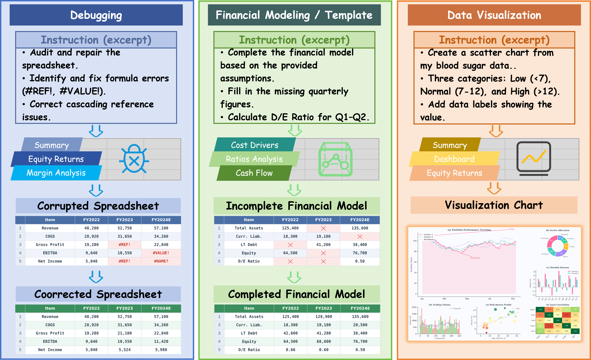

<div align="center">
  <h1>SpreadsheetBench 2: Evaluating Agents on End-to-End Business Spreadsheet Workflows</h1>
  <p>
    <a href="https://spreadsheetbench.github.io/">💻 <strong>Website</strong></a> |
    <a href="https://arxiv.org/abs/2606.29955">📄 <strong>Paper (arXiv)</strong></a> |
    <a href="https://huggingface.co/datasets/KAKA22/SpreadsheetBench-v2">📦 <strong>Dataset</strong></a> |
  </p>
</div>


<p align="center">
  
</p>

SpreadsheetBench 2 is a benchmark for evaluating agents on end-to-end business spreadsheet workflows. Unlike existing benchmarks that focus on isolated manipulations, SpreadsheetBench 2 requires agents to (1) complete workflow-level goals through multi-step coordinated operations, (2) perform cross-sheet reasoning within complex multi-sheet workbooks, (3) produce deliverable-level outcomes including structured models, repaired spreadsheets, and accurate visualizations.

## 📢 News

- **2026-6**: 🔥Released the SpreadsheetBench 2 dataset, paper, and code.

## 📦 Dataset Introduction

Place the dataset under the `data/` directory. SpreadsheetBench 2 contains four categories:


| Category            | Description                              |
| ------------------- | ---------------------------------------- |
| `Debugging`       | Formula debugging and error correction.  |
| `Financial_Model` | Financial modeling and calculation.      |
| `Template`        | Template-based spreadsheet operations.   |
| `Visualization`   | Chart generation and data visualization. |

Each category folder should contain a `dataset.json` file and the corresponding spreadsheet files under `spreadsheet/`.

Expected layout:

* `id`: The unique id of the data point.
* `instruction`: The question about spreadsheet manipulation.
* `spreadsheet_path`: The folder path that stores the input file.
* `golden_response_path`: The folder path that stores the answer file.

## 🚀 Running Code

### 1. ⚙️ Install Dependencies

Create and activate the Conda environment:

```bash
conda create -n ssb-v2 python==3.11 -y
conda activate ssb-v2
```

Install SWE-agent:

```bash
cd SWE-agent
pip install --upgrade pip
pip install --editable .
```

### 2. 🐳 Build Docker Image

Run this command from the repository root:

```bash
docker build -f spreadsheet.Dockerfile -t spreadsheetbench-v2 .
```

### 3. ▶️ Run Experiments

Run SWE-agent from the `SWE-agent/` directory. A complete runnable example is provided in `SWE-agent/scripts/example.sh`.

```bash
conda activate ssb-v2
cd SWE-agent

sweagent run \
  --config config/spreadsheet.yaml \
  --env.deployment.image spreadsheetbench-v2 \
  --agent.model.name='openrouter/z-ai/glm-5' \
  --agent.model.api_key='<your_api_key>' \
  --agent.model.completion_kwargs='{"extra_body": {"reasoning": {"enabled": true}}}' \
  --dataset_path ../data/spreadsheetbench-v2/<Category>
```

Replace `<Category>` with one of:

```text
Debugging
Financial_Model
Template
Visualization
```

For `Visualization` tasks, use `config/visualisation.yaml`:

```bash
sweagent run \
  --config config/visualisation.yaml \
  --env.deployment.image spreadsheetbench-v2 \
  --agent.model.name='openrouter/z-ai/glm-5' \
  --agent.model.api_key='<your_api_key>' \
  --agent.model.completion_kwargs='{"extra_body": {"reasoning": {"enabled": true}}}' \
  --dataset_path ../data/spreadsheetbench-v2/Visualization
```

### 4. 📈 Evaluate Outputs

After obtaining model outputs, return to the repository root and refresh cached spreadsheet values with LibreOffice:

```bash
python evaluation/open_spreadsheet.py \
  --dir_path <path_to_output_excel>
```

For `Debugging`, `Financial_Model`, and `Template` tasks:

```bash
python evaluation/evaluation.py \
  --model <model_name> \
  --dataset <Category> \
  --outputs-dir <path_to_output_excel> \
  --workers <N>
```

Results are written to `results/<Category>/`.

For `Visualization` tasks, use the VLM checklist evaluator with `glm-4.6v`:

```bash
python evaluation/run_visual_vlm_checklist_eval.py \
  --tasks-json data/spreadsheetbench-v2/Visualization/dataset.json \
  --output-dir <path_to_output_excel> \
  --api-key <your_bigmodel_api_key> \
  --model glm-4.6v
```

You can also provide the VLM API key through the environment:

```bash
export VLM_API_KEY=<your_bigmodel_api_key>
python evaluation/run_visual_vlm_checklist_eval.py \
  --tasks-json data/spreadsheetbench-v2/Visualization/dataset.json \
  --output-dir <path_to_output_excel> \
  --model glm-4.6v
```

The visualization evaluator saves a JSON report next to the output directory by default, named `evaluation_report_<output-dir-name>.json`.

## 🙏 Acknowledgements

 We thank the [SWE-agent](https://github.com/SWE-agent/SWE-agent) for their open-source infrastructure.